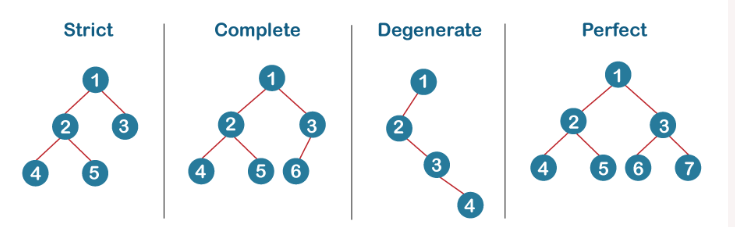

> # BINARY TREES
> 
# Table of contents
TASK NUMBER | LINK TO TASK CODE | TASK DESCRIPTION
----- | ------ | ----------
[0x00] | [New node](./0-binary_tree_node.c) | A function that creates a binary tree node.
[0x01] | [Insert left](./1-binary_tree_insert_left.c) | Inserts a node at the left child of another node
[0x02] | [Insert right](./2-binary_tree_insert_left.c) | Inserts a node at the right child of another node
[0x03] | [Delete node](./3-binary_tree_delete.c) | A function that deletes an entire binary tree.
[0x04] | [Is leaf](./4-binary_tree_is_leaf.c) | A function that checks if a node is a leaf.
[0x05] | [Is root](./5-binary_tree_is_root.c) | A function that checks if a node is a root.
[0x06] | [Pre-order Traversal](./6-binary_tree_preorder.c) | A function that goes through a binary tree using pre-order traversal.
[0x07] | [In-order Traversal](./7-binary_tree_inorder.c) | A function that goes through a binary tree using in-order traversal.
[0x08] | [Post-order Traversal](./8-binary_tree_postorder.c) | A function that goes through a binary tree using post-order traversal.
[0x09] | [Height](./9-binary_tree_height.c) | A function that measures the height of a binary treel.
[0x10] | [Depth](./10-binary_tree_depth.c) | A function that measures the depth of a node in a binary tree.
[0x11] | [Size](./11-binary_tree_size.c) | A function that measures the size of a binary tree
[0x12] | [Leaves](./12-binary_tree_leaves.c) | A function that counts the leaves in a binary tree.
[0x13] | [Nodes](./13-binary_tree_nodes.c) | A  function that counts the nodes with at least 1 child in a binary tree.
[0x14] | [Balance factor](./14-binary_tree_balance.c) | A function that measures the balance factor of a binary tree.
[0x15] | [Is full](./15-binary_tree_is_full.c) | A function that checks if a binary tree is full.
[0x16] | [Is Perfect](./16-binary_tree_is_perfect.c) | A function that checks if a binary tree is perfect.
[0x17] | [Sibling](./17-binary_tree_sibling.c) | A function that finds the sibling of a node
[0x18] | [Uncle](./18-binary_tree_uncle.c) | A function that finds the Uncle of a node.
[] | [ ## ADVANCED TASKS] | 
[0x19] | [Lowest Common Ancestors](./100-binary_trees_ancestor.c) | A function that finds the lowest common ancestor of two nodes.
[0x20] | [Level-order traversal](./101-binary_tree_levelorder.c) | A function that goes through a binary tree using level-order traversal.s
<!-- [0x21] | [Is Complete](./102-binary_tree_is_complete.c) | A  function that checks if a binary tree is complete. -->
[0x22] | [Rotate left](./103-binary_tree_rotate_left.c) | A  function that Left-rotates a binary tree.
[0x22] | [Rotate left](./103-binary_tree_rotate_left.c) | A  function that Left-rotates a binary tree.
